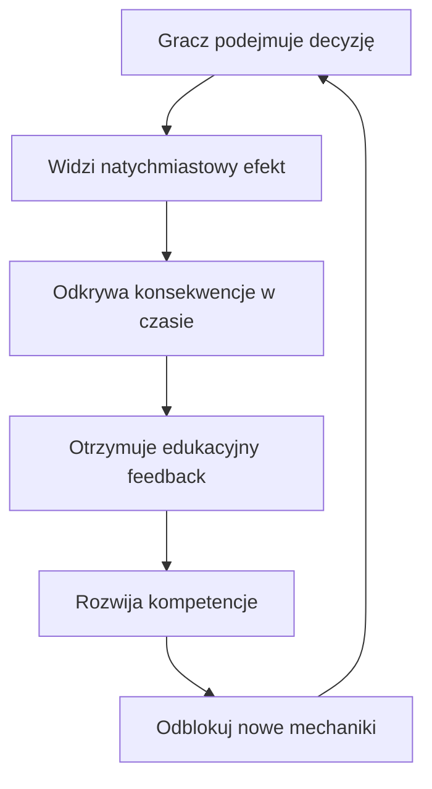

# Rozwój Gry PKO LockScreen — Plan Edukacji Finansowej przez Rozgrywkę

## Kontekst i Stan Aktualny

Gra symuluje ekran blokady telefonu, na którym gracz przechodzi przez trzy etapy życia finansowego — **Szkoła → Studia → Dorosłość**. Powiadomienia (wydatki/przychody) pojawiają się w czasie rzeczywistym. Gracz akceptuje (swipe prawo) lub odrzuca (swipe lewo). Istnieją obowiązkowe opłaty z karami, system inwestycji (Lokata/ETF/Crypto) oraz ranking wyników.

### Co już działa ✅
| Mechanika | Opis |
|---|---|
| **3 fazy trudności** | Szkoła (0-30s), Studia (30-60s), Dorosłość (60s+) |
| **44 powiadomienia** | Baza danych scenariuszy finansowych z wartościami i efektami energii |
| **Obowiązkowe opłaty** | System kar za ignorowanie (×5 wartości po 12s) |
| **Inwestycje** | Lokata (+5%/10s), ETF (wahania), Memecoin (hazard) |
| **Energia (Bateria)** | Drugie kryterium przegranej — wypalenie |
| **Ranking Top 5** | localStorage, animowany leaderboard |
| **Ekran Game Over** | Przyczyna, statystyka, restart |

### Czego brakuje ❌
- Gracz **nie uczy się** z decyzji — brak feedbacku edukacyjnego
- Brak widocznych **konsekwencji w czasie** — każda decyzja jest izolowana
- Brak **progresu między sesjami** — każda gra zaczyna się od zera
- Brak **personalizacji** poziomu wiedzy
- Brak **pętli zaangażowania** — motywacji do powrotu

---

## Główne Cele Rozwoju



---

## Faza 1: Edukacyjny Feedback na Powiadomieniach
> **Cel:** Każda decyzja finansowa uczy — nie tylko przez liczbę, ale przez kontekst.

### Mechanika „Czy wiesz, że...?"
Po zaakceptowaniu lub odrzuceniu powiadomienia, na 2-3 sekundy wyświetla się **mini-tip edukacyjny** — krótka informacja powiązana z podjętą decyzją.

**Przykłady:**
- Akceptujesz "Spotify -10zł" → 💡 *„Subskrypcje to ukryte koszty — 10 zł/msc to 120 zł/rok. Sprawdzaj, co naprawdę używasz."*
- Odrzucasz "Podręcznik -80zł" (obowiązkowy) → ⚠️ *„Ignorowanie obowiązkowych wydatków zawsze wraca ze zwiększonymi kosztami."*
- Akceptujesz "Kieszonkowe +50zł" → 💡 *„Regularne dochody to fundament budżetowania. Zaplanuj, ile odłożysz."*

---

### Proponowane Zmiany

#### [NEW] `src/lib/educationalTips.ts`
Baza wskazówek edukacyjnych powiązanych z kategoriami decyzji:
- Mapa `category → tip[]` (np. „Abonament", „Szkoła", „Praca", „Rodzina")
- Osobne wskazówki dla: akceptacji, odrzucenia, i wygaśnięcia
- Funkcja `getRandomTip(appName, action)` → zwraca losowy tip z puli

#### [MODIFY] `src/components/lock/NotificationCard.tsx`
- Po wykonaniu swipe, zamiast natychmiastowego usunięcia karty — krótka animacja z tipem
- Toast/overlay z tipem na 2.5s z fade in/out

#### [NEW] `src/components/lock/EducationalToast.tsx`
- Komponent toast wyświetlający tip po interakcji
- Ikona 💡 + tekst + animacja wejścia (slide up) / wyjścia (fade out)
- Pozycja: na dole ekranu, nad home indicator

---

## Faza 2: Łańcuchy Konsekwencji (Event Chains)
> **Cel:** Decyzje mają widoczne skutki w czasie — nie są izolowane.

### Mechanika
Niektóre powiadomienia uruchamiają **łańcuch powiązanych zdarzeń**. Gracz widzi, jak jedna decyzja pociąga za sobą kolejne.

**Przykłady łańcuchów:**
```
Akceptujesz "Nowe buty -200zł"
  → 15s później: "Kumpel: Fajne buty! Gdzie kupiłeś?" (efekt społeczny, energia +5)
  → 30s później: "Mama: Czy naprawdę potrzebowałeś nowych butów?" (energia -10)

Odrzucasz "Bilet miesięczny -55zł" (obowiązkowy)
  → 12s: KARA "Grzywna MZK -275zł"
  → 20s: "Czy wiesz, że...? Bilet ulgowy to inwestycja — porównaj koszt z mandatami."
```

### Proponowane Zmiany

#### [MODIFY] `src/lib/notifications.ts`
- Rozszerzenie `NotificationData` o pole `chainEvents?: ChainEvent[]`
- `ChainEvent` = `{ delay: number, notification: Partial<NotificationData>, condition: 'accepted' | 'rejected' }`
- Dodanie powiązanych zdarzeń do 8-10 istniejących powiadomień

#### [MODIFY] `src/app/page.tsx`
- Po swipe, sprawdź `chainEvents` na powiadomieniu
- Zaplanuj kolejne zdarzenia łańcuchowe z odpowiednimi delayami (`setTimeout`)
- Dodaj tracking aktywnych łańcuchów do cleanup w `restartGame()`

---

## Faza 3: Wskaźnik Zdrowia Finansowego
> **Cel:** Gracz widzi nie tylko saldo, ale jakość swoich decyzji — jak w prawdziwym życiu.

### Mechanika
Nowy wskaźnik **„Indeks Finansowy PKO"** (0-100) obok salda, który odzwierciedla:
- Regularność opłacania obowiązkowych rachunków
- Stosunek oszczędności do wydatków
- Dywersyfikację inwestycji
- Impulsywność (ile razy gracz przyjął drogie niepotrzebne wydatki)

Wskaźnik zmienia kolor: 🟢 80-100 | 🟡 50-79 | 🔴 0-49

### Proponowane Zmiany

#### [NEW] `src/hooks/useFinancialHealth.ts`
- Hook trackujący metryki decyzji: `mandatoryPaid`, `mandatoryMissed`, `impulseSpending`, `savingsRate`
- Funkcja obliczająca score 0-100 na podstawie ważonych metryk
- Eksport wyniku + breakdownu do Game Over

#### [MODIFY] `src/app/page.tsx`
- Dodanie widgetu „Indeks Finansowy" w UI gry (obok czasu i fazy)
- Animowana zmiana koloru wskaźnika w czasie rzeczywistym

#### [MODIFY] `src/components/lock/Leaderboard.tsx`
- Dodanie kolumny „Indeks" do rankingu (obok czasu i salda)

---

## Faza 4: System Osiągnięć i Odznak
> **Cel:** Pętle zaangażowania — motywacja do powrotu i eksperymentowania z różnymi strategiami.

### Mechanika
Odznaki odblokowane za konkretne osiągnięcia:

| Odznaka | Warunek | Czego uczy |
|---|---|---|
| 🎓 **Absolwent** | Przetrwaj fazę Szkoła | Podstawy budżetowania |
| 💰 **Oszczędny** | Zakończ z saldem > 5000 zł | Wartość oszczędzania |
| 🏦 **Inwestor** | Użyj wszystkich 3 narzędzi inwestycyjnych | Dywersyfikacja |
| ⚡ **Speedrun** | Przetrwaj 90s | Zarządzanie pod presją |
| 🛡️ **Odpowiedzialny** | Zapłać wszystkie obowiązkowe w jednej sesji | Priorytetyzacja |
| 🎰 **Hazardzista** | Wrzuć > 1000zł w Memecoin | Edukacja o ryzyku hazardu |
| 📊 **Strateg** | Indeks Finansowy > 80 | Kompleksowe zarządzanie |
| 🔥 **Survivor** | Przetrwaj Dorosłość 30s | Zaawansowane finanse |

### Proponowane Zmiany

#### [NEW] `src/lib/achievements.ts`
- Definicja odznak z warunkami, ikonami, opisami
- Funkcja `checkAchievements(gameState)` → nowo-odblokowane odznaki
- Persystencja w localStorage (niezależna od highscores)

#### [NEW] `src/components/lock/AchievementPopup.tsx`
- Popup/toast po odblokowaniu odznaki w trakcie gry
- Złoty efekt confetti + ikona + nazwa

#### [MODIFY] Game Over screen w `src/app/page.tsx`
- Sekcja "Nowe odznaki" pod statystykami
- Pełna kolekcja odznak (odblokowane vs zablokowane)

---

## Faza 5: Zaawansowany Game Over — Analiza Decyzji
> **Cel:** Ekran końcowy staje się lekcją, nie tylko wynikiem.

### Mechanika
Po przegranej gracz widzi:

1. **Podsumowanie finansowe** — ile zarobił, ile wydał, ile zainwestował
2. **Najlepsza decyzja** — powiadomienie, które dało najwięcej wartości
3. **Najgorsza decyzja** — powiadomienie, które najbardziej obciążyło budżet
4. **Wskazówka PKO** — spersonalizowana rada na podstawie stylu gry:
   - *"Dużo wydajesz impulsowo — spróbuj zasady 24h: jeśli nie potrzebujesz od razu, odczekaj."*
   - *"Ignorujesz obowiązkowe opłaty — w rzeczywistości prowadzi to do windykacji i BIK."*
   - *"Świetna dywersyfikacja inwestycji! W PKO możesz zacząć od TFI lub IKE."*

### Proponowane Zmiany

#### [NEW] `src/hooks/useDecisionTracker.ts`
- Hook zbierający historię decyzji w trakcie gry
- Każdy swipe loguje: `{ notif, action: 'accept'|'reject'|'expire', timestamp }`
- Na koniec gry: analiza wzorców (impulse ratio, mandatory compliance, total in/out)

#### [MODIFY] Game Over screen
- Dodanie sekcji „Twoja analiza" z wizualizacjami (mini-wykresy)
- „Wskazówka PKO" z ikoną banku i spersonalizowaną radą

---

## Faza 6: Tutoriale i Onboarding per Faza
> **Cel:** Nowi gracze nie czują się zagubieni, zaawansowani nie czują się znudzeni.

### Mechanika
- **Pierwszy raz w grze**: Animowany mini-tutorial (3 slajdy) wyjaśniający swipe mechanikę
- **Pierwsza zmiana fazy** (Szkoła→Studia): Krótki overlay: *"Wchodzisz na studia! Wydatki rosną, ale pojawiają się nowe źródła dochodu."*
- **Otwarcie inwestycji po raz pierwszy**: Tooltip-guided tour po Lokacie, ETF, Crypto

### Proponowane Zmiany

#### [NEW] `src/components/lock/TutorialOverlay.tsx`
- Komponent wyświetlający animowane instrukcje
- Warunek: `localStorage.getItem('pko_tutorial_seen')` — wyświetl tylko raz

#### [NEW] `src/components/lock/PhaseTransition.tsx`
- Full-screen overlay z animacją przejścia między fazami
- Krótki opis nowej fazy + nowe mechaniki
- Auto-dismiss po 3s lub tap to skip

#### [MODIFY] `src/app/page.tsx`
- Detekcja zmiany fazy → wyświetlenie PhaseTransition
- Detekcja pierwszej gry → wyświetlenie TutorialOverlay

---

## Faza 7: System Celów Oszczędnościowych
> **Cel:** Gracz ma do czego dążyć — konkretny cel finansowy zwiększa motywację.

### Mechanika
Na początku gry gracz widzi **cel oszczędnościowy** (np. „Odłóż 500 zł na wakacje"). Jeśli zakończy grę z wystarczającą ilością odłożonych pieniędzy, cel jest „spełniony" — dodatkowa odznaka i bonus do Indeksu Finansowego.

Cele zmieniają się per faza:
- Szkoła: „Odłóż na nowego laptopa" (300 zł)
- Studia: „Fundusz awaryjny" (1000 zł)
- Dorosłość: „Wpłata na mieszkanie" (3000 zł)

### Proponowane Zmiany

#### [NEW] `src/lib/savingsGoals.ts`
- Definicja celów per faza z kwotami i opisami
- Tracking postępu (ile z portfela inwestycyjnego jest alokowane)

#### [NEW] `src/components/lock/SavingsGoalWidget.tsx`
- Elegancki progress bar z celem
- Wyświetlany w UI gry jako widget

---

## Priorytetyzacja Implementacji

| # | Faza | Impact edukacyjny | Złożoność | Priorytet |
|---|---|---|---|---|
| 1 | **Educational Tips** | 🟢 Wysoki | 🟢 Niska | 🔴 **P0 — teraz** |
| 2 | **Event Chains** | 🟢 Wysoki | 🟡 Średnia | 🟠 **P1** |
| 3 | **Phase Transitions** | 🟡 Średni | 🟢 Niska | 🟠 **P1** |
| 4 | **Financial Health Score** | 🟢 Wysoki | 🟡 Średnia | 🟡 **P2** |
| 5 | **Decision Analysis (Game Over)** | 🟢 Wysoki | 🟡 Średnia | 🟡 **P2** |
| 6 | **Achievements** | 🟡 Średni | 🟡 Średnia | 🟡 **P2** |
| 7 | **Tutorial/Onboarding** | 🟡 Średni | 🟢 Niska | 🔵 **P3** |
| 8 | **Savings Goals** | 🟡 Średni | 🟢 Niska | 🔵 **P3** |

---

## User Review Required

> [!IMPORTANT]
> **Zakres implementacji:** Czy chcesz, żebym zaimplementował **wszystkie 7 faz** w jednym podejściu, czy preferujesz iteracyjne podejście (np. zacznijmy od P0 + P1)?

> [!IMPORTANT]
> **Branding PKO:** Czy dodać elementy brandingowe PKO (logo, kolory #004B87, komunikaty "z PKO Bank Polski") w tipach edukacyjnych i na Game Over?

> [!WARNING]
> **Wielkość bazy powiadomień:** Fazy 1-2 wymagają znacznego rozszerzenia `notifications.ts` — z 44 wpisów do ~80+ z tipami i łańcuchami. Czy to akceptowalne?

## Verification Plan

### Automated Tests
- `npx tsc --noEmit` — sprawdzenie typów po każdej fazie
- Testy w przeglądarce: rozegranie pełnej sesji od Szkoła do Game Over
- Weryfikacja localStorage (ranking, odznaki, tutorial flags)

### Manual Verification
- Sprawdzenie czytelności tipów edukacyjnych na ekranie telefonu
- Test łańcuchów konsekwencji — czy kolejne zdarzenia pojawiają się we właściwym czasie
- Weryfikacja Phase Transition overlay przy 30s i 60s
- Sprawdzenie analityki Game Over po różnych stylach gry
